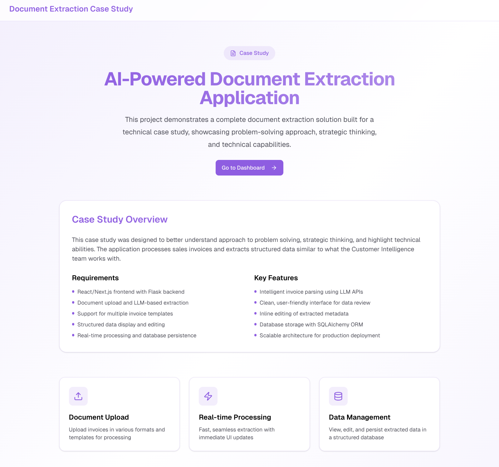
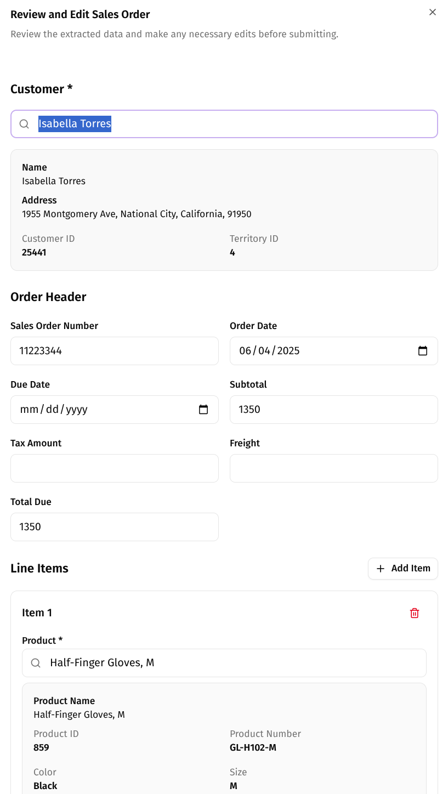
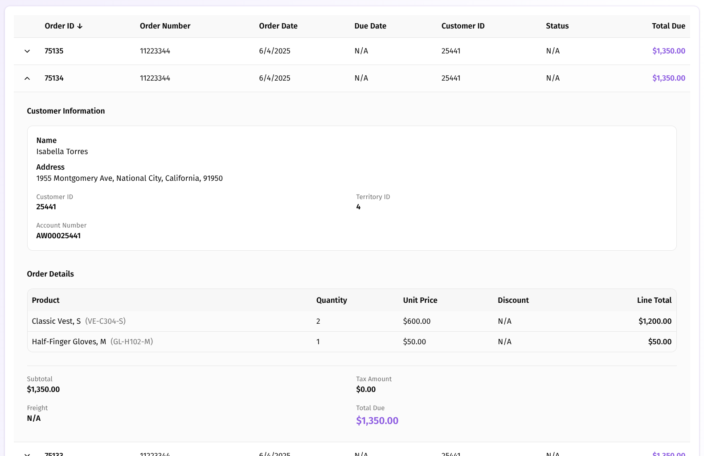

# Document Extraction Case Study

## Overview

This project is a technical case study demonstrating an AI-powered document extraction application. The solution processes sales invoices using Large Language Models (LLMs) to extract structured data, presenting it through a modern web interface with real-time processing capabilities.

The application was built to showcase problem-solving approach, strategic thinking, and technical abilities in handling document processing workflows similar to those used by Customer Intelligence teams.

## Application Showcase

The following screenshots demonstrate the user journey through the application:

### Homepage
The landing page introduces the case study and provides an overview of the application's capabilities.



### Sales Orders Dashboard
The main dashboard displays all imported sales orders in an interactive table, allowing users to view, search, and manage orders.


### Review Sales Orders After Importing
After uploading an invoice, users can review and edit the extracted data before saving it to the database. This interface shows the extracted header information and line items.



### View Sales Order Details
The detailed view provides comprehensive information about a specific sales order, including all line items, customer information, and order metadata.



## Case Study Context

This case study was designed to better understand approach to problem solving, strategic thinking, and highlight technical abilities. The application processes sales invoices and extracts structured data that mimics the structure found in `SalesOrderDetail` and `SalesOrderHeader` tables, demonstrating:

- **Full-stack development** with React/Next.js frontend and Flask backend
- **AI/LLM integration** for intelligent document extraction
- **Real-time processing** with seamless UI updates
- **Data management** with structured storage and editing capabilities
- **Scalability considerations** for production deployment

## Architecture

### Front-End (`/front-end`)

A modern React/Next.js application providing an intuitive user interface for document upload, data visualization, and management.

**Technology Stack:**
- **Framework:** Next.js 16 (App Router)
- **Language:** TypeScript
- **Styling:** Tailwind CSS
- **UI Components:** Custom components with shadcn/ui patterns
- **State Management:** React hooks and local state

**Key Features:**
- Document upload interface with drag-and-drop support
- Real-time processing status indicators
- Interactive data tables for viewing extracted invoice data
- Inline editing capabilities for extracted metadata

**Getting Started:**
```bash
cd front-end
npm install
npm run dev
```

The frontend runs on `http://localhost:3000` by default.

### Back-End (`/back-end`)

A Flask-based REST API that handles document processing, LLM-based extraction, and database operations.

**Technology Stack:**
- **Framework:** Flask
- **Language:** Python 3.11
- **ORM:** SQLAlchemy
- **Database:** SQLite (easily swappable for PostgreSQL)
- **LLM Integration:** OpenAI API (configurable for other providers)
- **OCR:** Tesseract (for image-based invoices)

**Key Features:**
- Document upload and validation (PDF, PNG, JPG)
- LLM-powered invoice data extraction
- RESTful API for CRUD operations on sales orders
- Structured data storage with relational models
- Support for multiple invoice templates

**Core API Endpoints:**
- `POST /upload` - Upload and process invoice documents
- `GET /sales_orders` - List all sales orders
- `GET /sales_orders/<id>` - Get specific sales order details
- `PUT /sales_orders/<id>` - Update sales order metadata
- `DELETE /sales_orders/<id>` - Delete sales order
- `GET /sales_order_details` - List all order line items
- `POST /sales_order_details` - Create new order line item
- `PUT /sales_order_details/<id>` - Update order line item
- `DELETE /sales_order_details/<id>` - Delete order line item

**Getting Started:**
```bash
cd back-end
python -m venv .venv
source .venv/bin/activate  # Windows: .venv\Scripts\activate
pip install -r requirements.txt

# Set up environment variables
echo "OPENAI_API_KEY=your_api_key_here" > .env

# Initialize database (copy the provided Excel file into this directory)
python init_db.py

# Run the server
export FLASK_APP=app.py
export FLASK_ENV=development
flask run
```

The backend API runs on `http://localhost:5000` by default.

## Project Structure

```
invoice-extractor/
├── front-end/                 # Next.js frontend application
│   ├── app/                   # Next.js app directory
│   │   ├── page.tsx          # Landing page
│   │   └── dashboard/        # Dashboard with invoice management
│   ├── components/           # React components
│   │   └── ui/              # Reusable UI components
│   ├── lib/                 # Utility functions
│   └── package.json         # Frontend dependencies
│
├── back-end/                 # Flask backend API
│   ├── app.py               # Main Flask application
│   ├── models.py            # SQLAlchemy ORM models
│   ├── db.py                # Database configuration
│   ├── openai_full_data_extraction.py # LLM extraction logic
│   ├── init_db.py           # Database initialization
│   └── requirements.txt     # Python dependencies
│
└── README.md                # This file
```

## Data Model

The application extracts and stores invoice data in a structure that mirrors typical sales order systems:

- **SalesOrderHeader**: Order-level information (dates, customer, totals, shipping)
- **SalesOrderDetail**: Line items with product details, quantities, and pricing
- **Product**: Product catalog information
- **Customer**: Customer information
- **ProductCategory/ProductSubCategory**: Product classification

## Key Capabilities Demonstrated

### 1. Document Processing
- Support for multiple document formats (PDF, images)
- OCR capabilities for scanned documents
- Template-agnostic extraction using LLMs

### 2. AI/LLM Integration
- Intelligent field extraction from unstructured documents
- Handling of various invoice templates and formats
- Structured data output matching database schema

### 3. Real-Time Interaction
- Fast processing with immediate UI feedback
- Seamless data flow from upload to database
- Live status updates during processing

### 4. Data Management
- Clean, user-friendly interface for data review
- Inline editing of extracted metadata
- Persistent storage with full CRUD operations

### 5. Scalability Considerations
- Modular architecture for easy extension
- Database abstraction for production databases
- API design supporting async processing
- Ready for task queues (Celery) for heavy workloads

## Prerequisites

### Front-End
- Node.js 18+ and npm
- Modern web browser

### Back-End
- Python 3.11+
- LLM API key (OpenAI or compatible)
- Tesseract OCR (optional, for image processing)

## Environment Setup

### Back-End Environment Variables

Create a `.env` file in the `back-end` directory:

```env
OPENAI_API_KEY=your_api_key_here
FLASK_ENV=development
```

## Running the Application

1. **Start the backend:**
   ```bash
   cd back-end
   source .venv/bin/activate
   flask run
   ```

2. **Start the frontend (in a new terminal):**
   ```bash
   cd front-end
   npm run dev
   ```

3. **Access the application:**
   - Frontend: http://localhost:3000
   - Backend API: http://localhost:5000

## Testing

The backend includes test suites for:
- Document upload handling
- LLM parsing functionality
- CRUD operations
- Data validation

Run tests with:
```bash
cd back-end
pytest tests/
```

## Deployment Considerations

For production deployment, consider:

- **Backend:**
  - Use Gunicorn or uWSGI as WSGI server
  - Deploy behind Nginx or cloud load balancer
  - Migrate from SQLite to PostgreSQL
  - Implement task queues (Celery) for async processing
  - Add rate limiting and authentication

- **Frontend:**
  - Build optimized production bundle
  - Deploy to Vercel, Netlify, or similar
  - Configure environment variables for API endpoints
  - Enable caching and CDN for static assets

## Future Enhancements

Potential improvements for production scale:

- Support for additional document types (receipts, purchase orders)
- Batch processing capabilities
- Advanced validation and error handling
- User authentication and multi-tenancy
- Analytics and reporting dashboards
- Webhook integrations for external systems
- Enhanced OCR with layout analysis
- Multi-language support

## License

This project was created as a technical case study demonstration.
